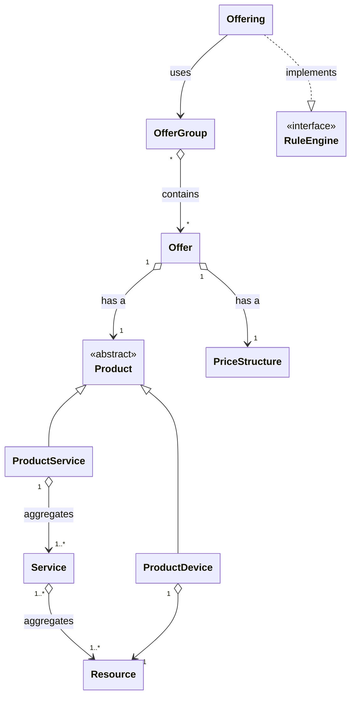

```mermaid
%%{
    init:{
        "nodeSpacing": "100",
        "rankSpacing": "100",
        "class": {
            "hideEmptyMembersBox": true
        }
    }
}%%
classDiagram
class Resource
class Service
class Product {<<abstract>>}
class ProductService
class ProductDevice
class Offer
class PriceStructure
class OfferGroup
class Offering
class RuleEngine {<<interface>>}

Product <|-- ProductService
Product <|-- ProductDevice

Service "1..*" o--> "1..*" Resource : aggregates
ProductDevice "1" o--> "1" Resource
ProductService "1" o--> "1..*" Service : aggregates
Offer "1" o--> "1" Product : has a
Offer "1" o--> "1" PriceStructure : has a
OfferGroup "*" o--> "*" Offer : contains
Offering -->  OfferGroup : uses
Offering ..|> RuleEngine : implements
```
