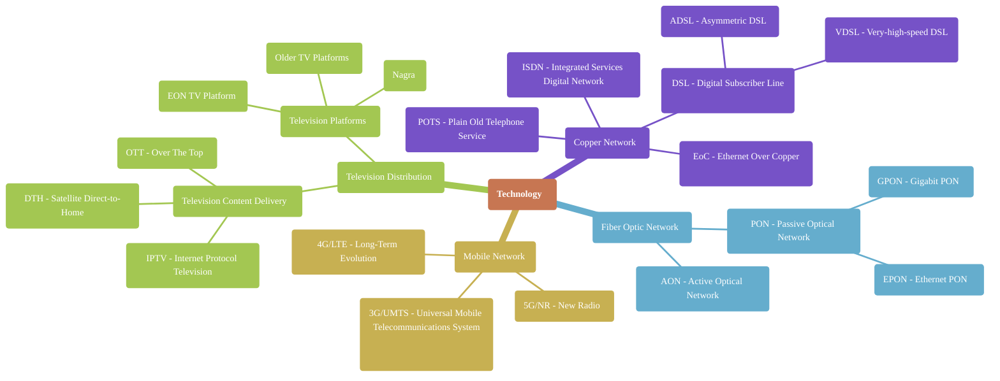
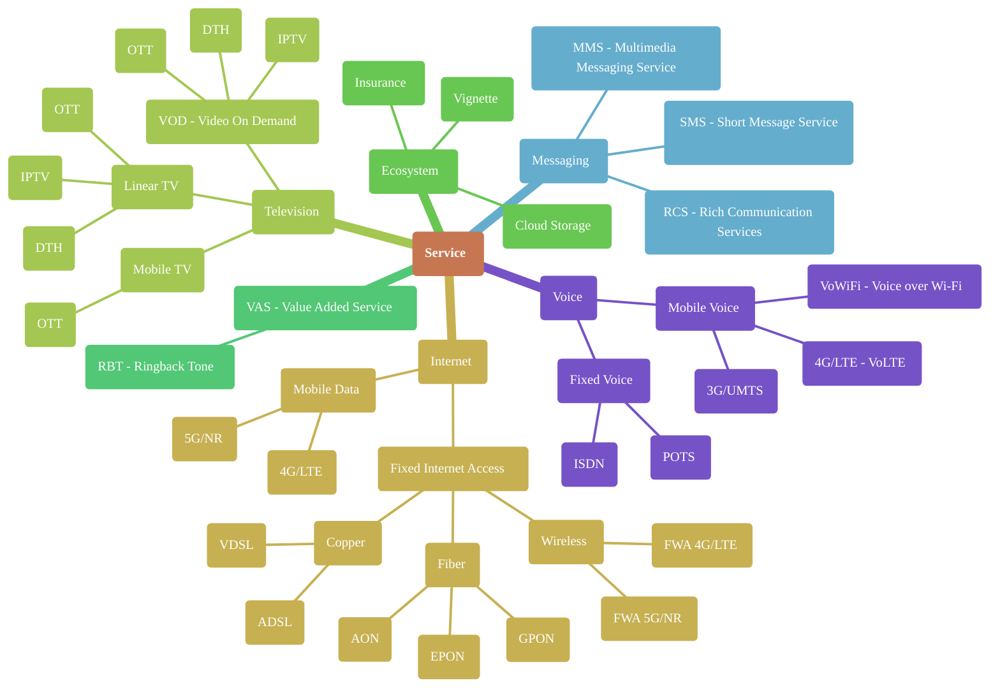
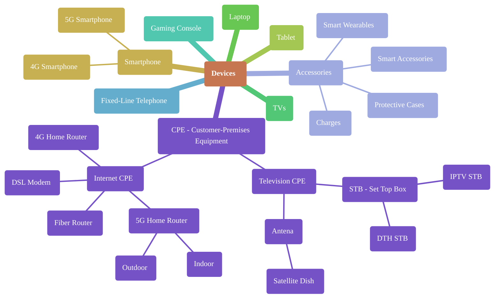
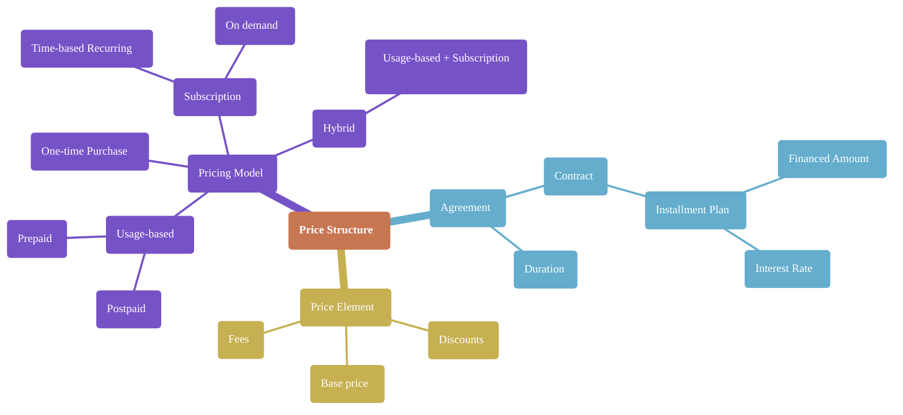

## Table of Contents
- [Technology](#technology)
- [Services](#services)
- [Devices](#devices)
- [Price Structure](#price-structure)

## Technology
Classification by area:
- LAN (Local Area Network) - A small-scale network within a building or campus
- MAN (Metropolitan Area Network) - A city-wide network connecting multiple LANs
- WAN (Wide Area Network) - A large-scale network spanning cities or countries

## Services
From technologies point of view

## Devices

## Price structure
