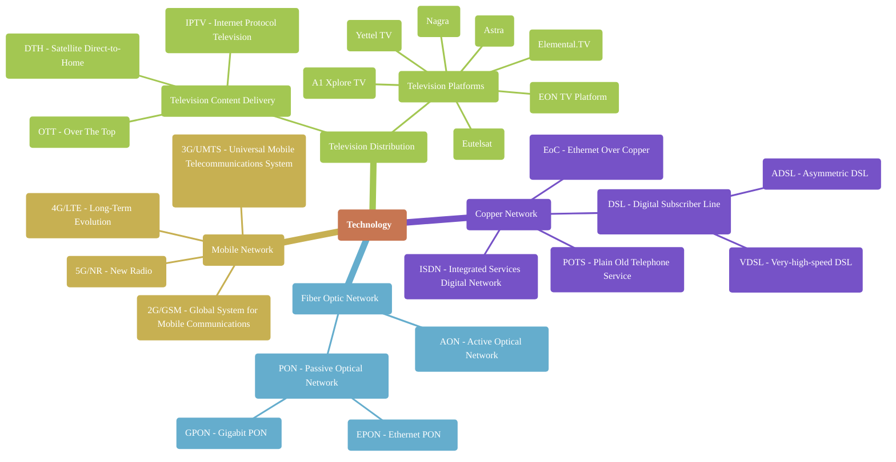
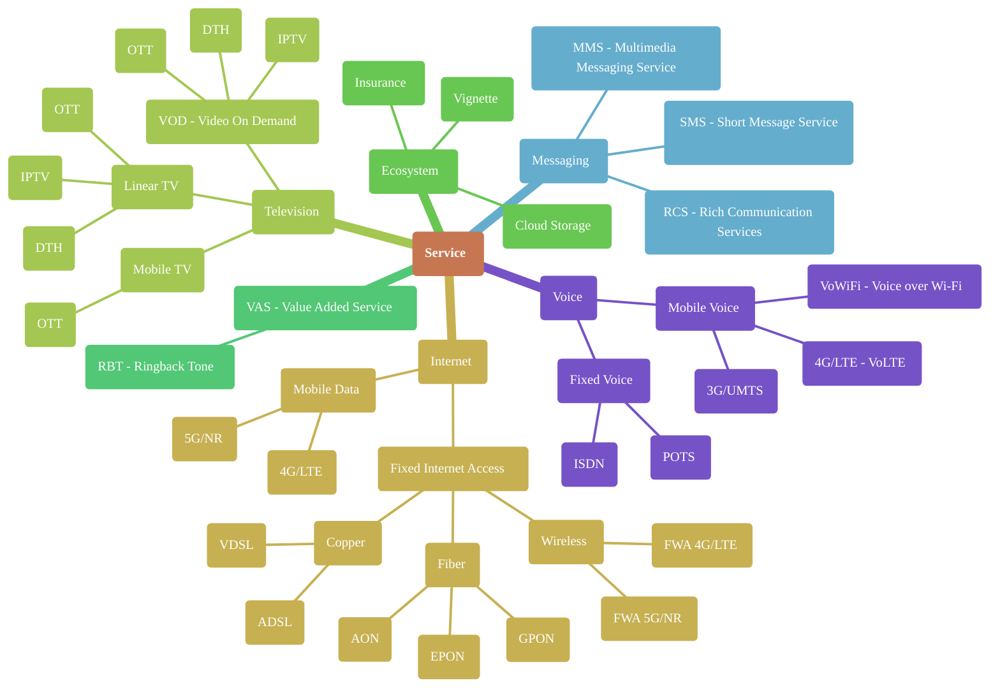
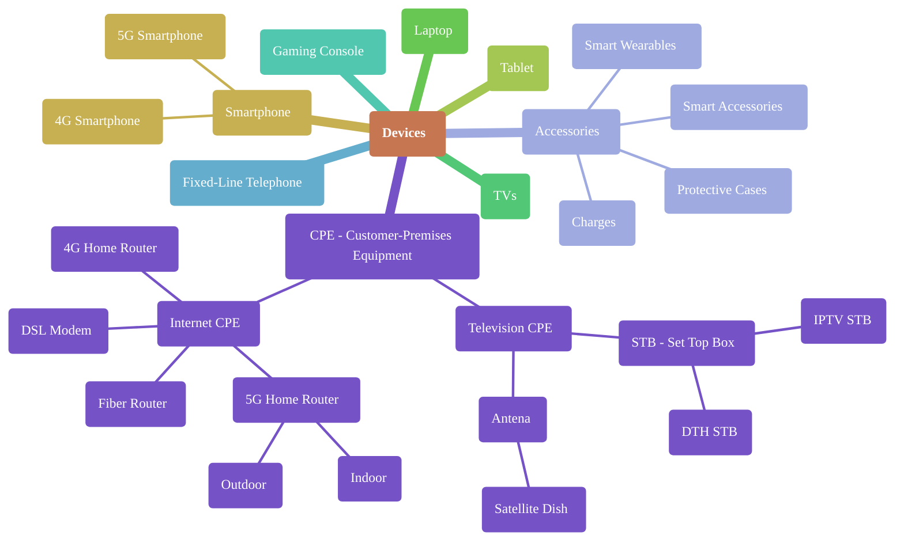
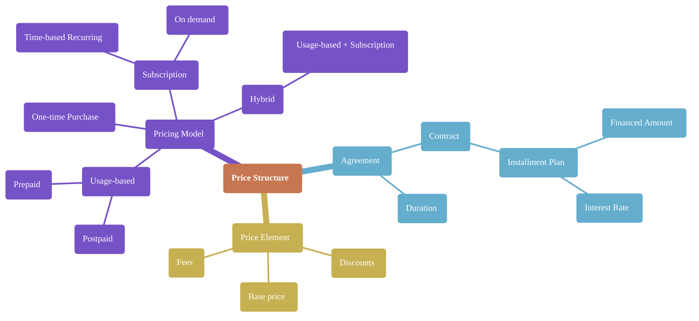
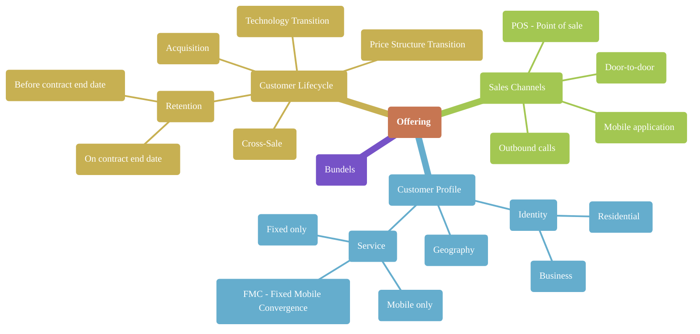

## Table of Contents
- [Technology](#technology)
- [Services](#services)
- [Devices](#devices)
- [Price Structure](#price-structure)
- [Offering](#offering)
- [Sources](#sources)

## Technology
Classification by area:
- LAN (Local Area Network) - A small-scale network within a building or campus
- MAN (Metropolitan Area Network) - A city-wide network connecting multiple LANs
- WAN (Wide Area Network) - A large-scale network spanning cities or countries

## Services
From technologies point of view

## Devices

## Price structure

## Offering

## Sources
### Technology
#### LAN, MAN, WAN Definitions
* [Local Area Network (LAN)](https://en.wikipedia.org/wiki/Local_area_network)
* [Metropolitan Area Network (MAN)](https://en.wikipedia.org/wiki/Metropolitan_area_network)
* [Wide Area Network (WAN)](https://en.wikipedia.org/wiki/Wide_area_network)
* [LAN Definition](https://www.techtarget.com/searchnetworking/definition/local-area-network-LAN)
* [MAN Definition](https://www.techtarget.com/searchnetworking/definition/metropolitan-area-network-MAN)
* [WAN Definition](https://www.techtarget.com/searchnetworking/definition/wide-area-network-WAN)
#### Copper Network Technologies (POTS, DSL, ISDN, EoC)
* [Plain Old Telephone Service (POTS)](https://en.wikipedia.org/wiki/Plain_old_telephone_service)
* [Digital Subscriber Line (DSL)](https://en.wikipedia.org/wiki/Digital_subscriber_line)
* [Integrated Services Digital Network (ISDN)](https://en.wikipedia.org/wiki/Integrated_Services_Digital_Network)
* [Ethernet over Copper (EoC)](https://en.wikipedia.org/wiki/Ethernet_in_the_first_mile)
#### Fiber Optic Network Technologies (AON, PON, EPON, GPON)
* [Passive Optical Network (PON)](https://en.wikipedia.org/wiki/Passive_optical_network)
* [GPON](https://en.wikipedia.org/wiki/GPON)
* [EPON](https://en.wikipedia.org/wiki/Ethernet_PON)
* [What Is Passive Optical Networking (PON)?](https://www.cisco.com/c/en/us/products/switches/what-is-passive-optical-networking.html)
#### Mobile Network Technologies (3G/UMTS, 4G/LTE, 5G/NR)
* [GSM](https://en.wikipedia.org/wiki/GSM)
* [UMTS](https://en.wikipedia.org/wiki/Universal_Mobile_Telecommunications_System)
* [LTE](https://en.wikipedia.org/wiki/LTE_(telecommunication))
* [5G](https://en.wikipedia.org/wiki/5G)
#### Television Distribution Technologies (IPTV, DTH, OTT)
* [IPTV](https://en.wikipedia.org/wiki/IPTV)
* [Direct-to-Home (DTH)](https://en.wikipedia.org/wiki/Direct-broadcast_satellite_television)
* [Over-the-top media service (OTT)](https://en.wikipedia.org/wiki/Over-the-top_media_service)
#### Television Platforms
* [Vivacom Website](https://vivacom.bg/en/for-home/tv)
* [A1 Bulgaria Website](https://www.a1.bg/en/tv)
* [Yettel Bulgaria Website](https://www.yettel.bg/en/tv)
* [Nagra Website](https://www.nagra.com/)
* [Elemental.TV Website](https://elemental.tv/)
* [SES Astra Website](https://www.ses.com/networks/astra)
* [Eutelsat Website](https://www.eutelsat.com/)
